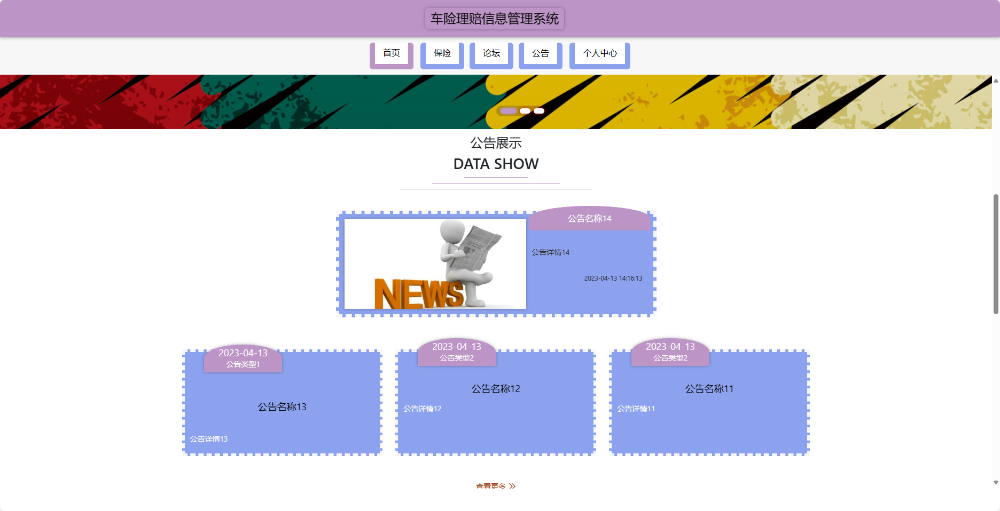
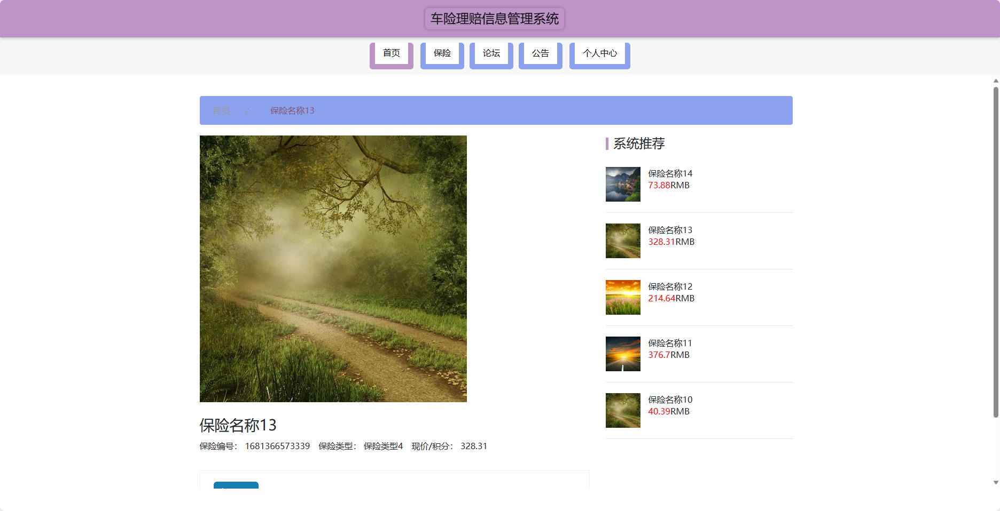
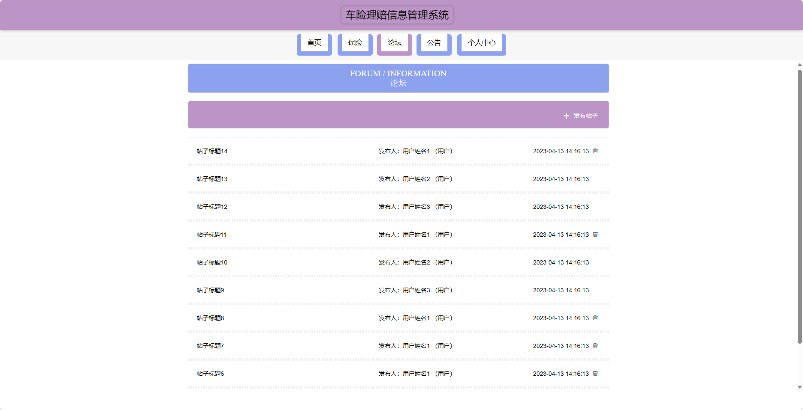
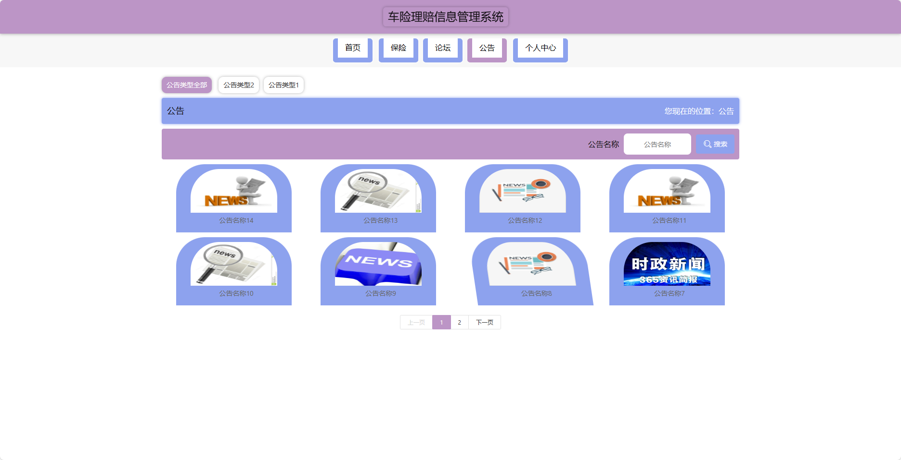
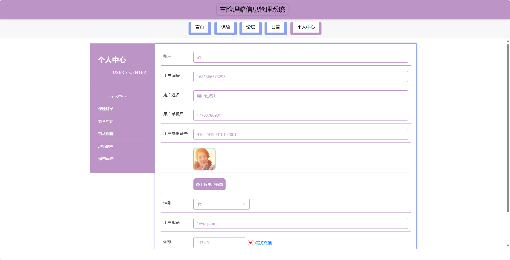
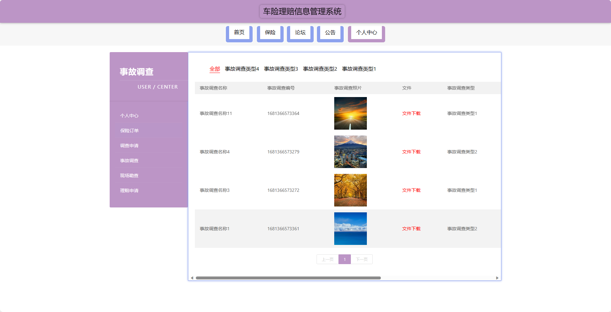
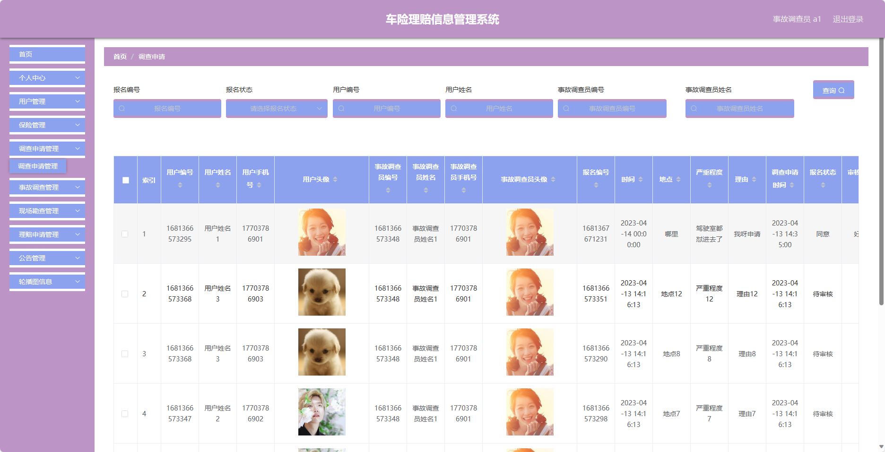
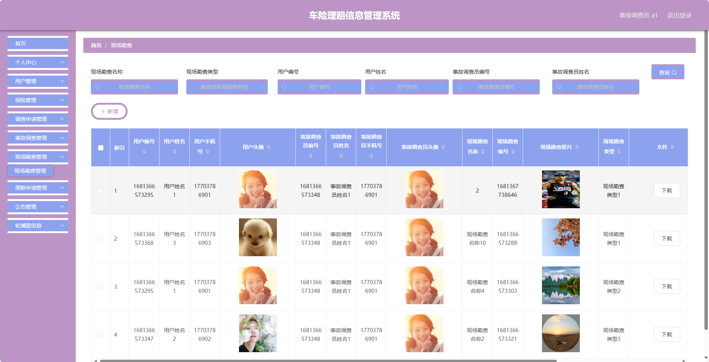
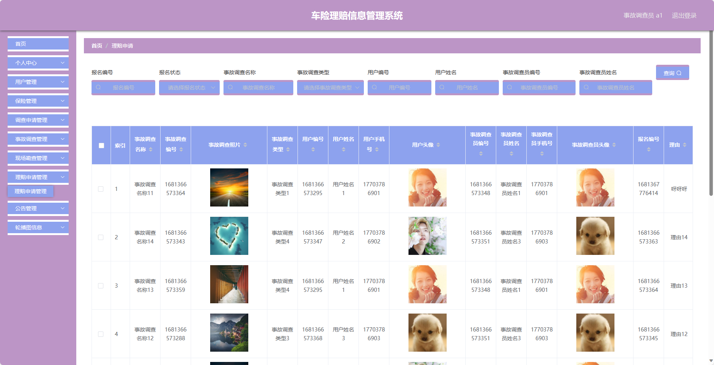

基于SpringBoot的车险理赔信息管理系统
=
- 完整代码获取地址：从戎源码网 ([https://armycodes.com/](https://armycodes.com/))
- 作者微信：19941326836  QQ：952045282 
- 承接计算机毕业设计、Java毕业设计、Python毕业设计、深度学习、机器学习
- 选题+开题报告+任务书+程序定制+安装调试+论文+答辩ppt 一条龙服务
- 所有选题地址https://github.com/nature924/allProject

一、项目介绍
---
基于Spring Boot框架实现的车险理赔信息管理系统，系统包含两种角色：管理员、用户,系统分为前台和后台两大模块，主要功能如下。

### 前台：
- 首页：展示系统的基本信息和导航链接。
- 保险：展示各类车险产品的信息。
- 论坛：提供用户之间的交流平台。
- 公告：展示系统发布的最新公告和通知。
- 个人中心：用户可以管理个人信息、查看自己的保险订单、留言、理赔申请等。

### 后台（管理员）：
- 个人中心：管理员可以管理个人信息，包括修改密码、查看个人信息等。
- 管理员管理：管理员可以管理其他管理员账号，包括添加、删除、编辑管理员账号等操作。
- 用户管理：管理员可以管理用户账号，包括查看用户列表、禁用用户等操作。
- 事故调查员管理：管理员可以管理事故调查员账号，包括添加、删除、编辑事故调查员账号等操作。
- 保险管理：管理员可以管理车险产品的信息，包括添加、删除、编辑保险产品等操作。
- 调查申请管理：管理员可以管理用户提交的事故调查申请，包括审核、分配调查员等操作。
- 事故调查管理：管理员可以管理事故调查的信息，包括查看调查记录、审核调查结果等操作。
- 现场勘查管理：管理员可以管理现场勘查的信息，包括添加、删除、编辑现场勘查记录等操作。
- 理赔申请管理：管理员可以管理用户提交的理赔申请，包括审核、处理理赔等操作。
- 论坛管理：管理员可以管理论坛的内容，包括审核、删除违规内容等操作。
- 公告管理：管理员可以管理系统发布的公告信息，包括添加、删除、编辑等操作。
- 基础数据管理：管理员可以管理系统的基础数据
- 轮播图信息：管理员可以管理首页轮播图的展示内容。

### 后台（事故调查员）：
- 个人中心：事故调查员可以管理个人信息，包括修改密码、查看个人信息等。
- 用户管理：事故调查员可以管理用户账号，包括查看用户列表、禁用用户等操作。
- 保险管理：事故调查员可以管理车险产品的信息，包括查看保险列表、保险详情等操作。
- 调查申请管理：事故调查员可以管理用户提交的事故调查申请，包括查看申请列表、接受任务等操作。
- 事故调查管理：事故调查员可以管理事故调查的信息，包括添加、删除、编辑调查记录等操作。
- 现场勘查管理：事故调查员可以管理现场勘查的信息，包括添加、删除、编辑现场勘查记录等操作。
- 理赔申请管理：事故调查员可以管理用户提交的理赔申请，包括查看申请列表、审核理赔等操作。
- 公告管理：事故调查员可以管理系统发布的公告信息，包括查看公告列表、发布公告等操作。
- 轮播图信息：事故调查员可以管理首页轮播图的展示内容。

二、项目技术
---
- 编程语言：Java
- 数据库：MySQL
- 项目管理工具：Maven
- 前端技术：VUE、HTML、Jquery、Bootstrap
- 后端技术：Spring、SpringMVC、MyBatis

三、运行环境
---
- 操作系统：Windows、macOS都可以
- JDK版本：JDK1.8以上都可以
- 开发工具：IDEA、Ecplise、Myecplise都可以
- 数据库: MySQL5.7以上都可以
- Tomcat：任意版本都可以
- Maven：任意版本都可以

四、运行截图
---

### 程序截图：

